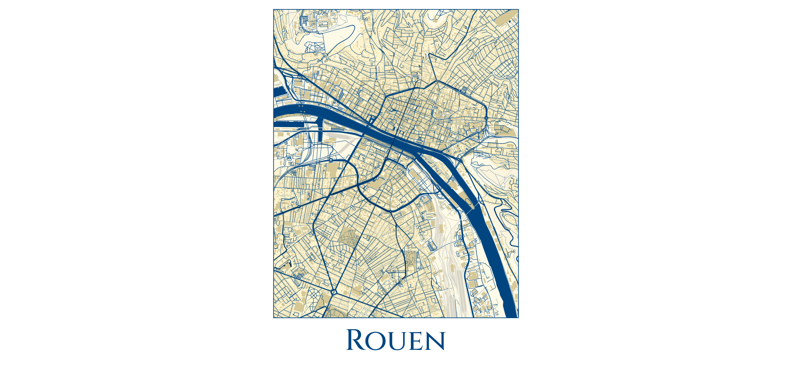

# Rouen map rendering

> Mapnik style of Rouen city



Get a full render in [PDF](render/render.pdf) or [PNG](render/render.png).

## Render it yourself

You can build the map yourself by retreiving data and building with mapnik.

Clone this repository and download the data from Rouen fron Planet.osm. You can [download an extract using BBBike](https://extract.bbbike.org/?sw_lng=0.953&sw_lat=49.363&ne_lng=1.211&ne_lat=49.515&format=osm.pbf&coords=0.953%2C49.363%7C1.21%2C49.363%7C1.211%2C49.515%7C0.953%2C49.515&city=Rouen%2C+Seine-Maritime%2C+Normandie%2C+France+m%C3%A9tropolitaine%2C+France). *You must download it as `.osm.pbf` and place it as `rouen.osm.pbf` in repository root*.

Run docker compose to start Postgres and copy extracted data into postgres. It takes usually 45s to 1min to setup postgres database.

```
docker-compose up
```

You're now ready to build the map using the provided script `render.sh`

```
./render.sh
```

Rendered maps are available as `render.png` and `render.svg`.

## Directory structure

* `docker-compose.yml` describe the docker infrastructure required to build the map
* `render.py` the main mapnik script used to define image size, output type, etc.
* `style.xml` the mapnik XML style
* `render.sh` render script calling mapnik container to render

* `layout.afdesign` Affinity designer file used to render the full poster
* `gros-horloge.afdesign` Affinity designer file used to add some pictos for the Gros-Horloge monument (abandonned)
* `get-extent.pgsql` A query sample calculating the extent you can use in your style

## Resources

* [Mapnik main site](https://mapnik.org/)
* [Mapnik XML style reference](https://github.com/mapnik/mapnik/wiki/XMLConfigReference)
* [PostgreSQL VS code extension](https://marketplace.visualstudio.com/items?itemName=ckolkman.vscode-postgres)
* [PostGis extension to Postgres SQL](https://postgis.net/)
* [Postgis reference](https://postgis.net/docs/reference.html)
* [Using env variables to configure PostgreSQL](https://www.postgresql.org/docs/current/libpq-envars.html)
* [Mapnik beginner tutorials](https://github.com/mapnik/mapnik/wiki/MapnikTutorials)